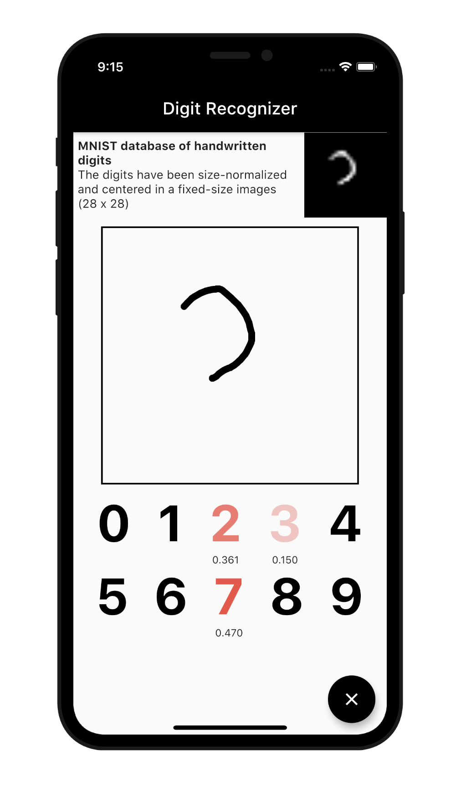
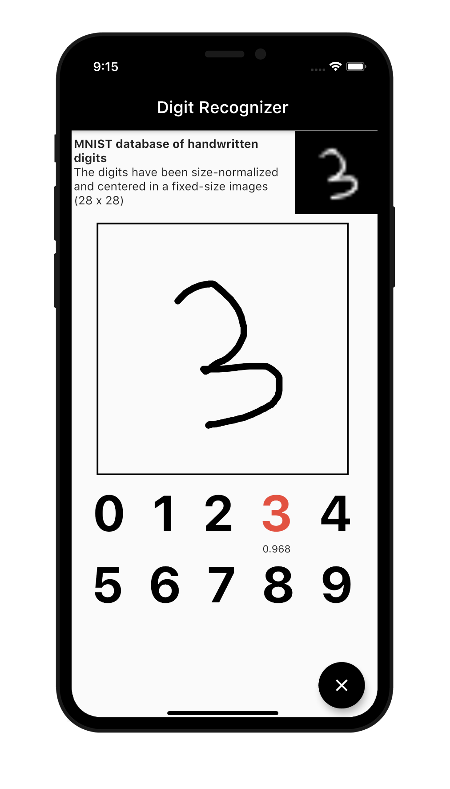
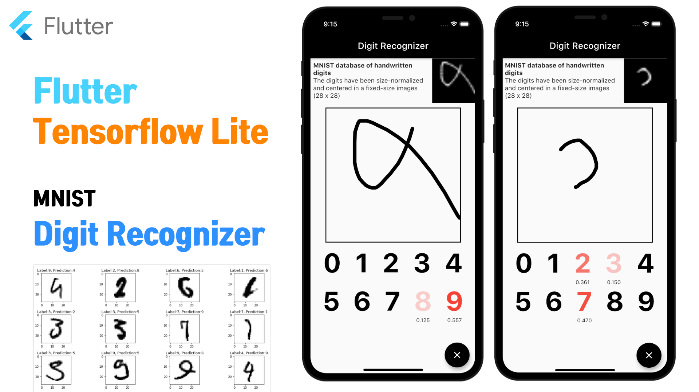

# Flutter Tensorflow Lite Digit Recognizer
Digit Recognizer using Tensorflow Lite and MNIST Data
(It works on both Android and iOS.)

  

#### Kaggle
- https://bit.ly/3g7jfTL

### Package
tflite : A Flutter plugin for accessing TensorFlow Lite API

https://pub.dev/packages/tflite

### Youtube

### More
- [flutter_tflite_style_transfer](https://github.com/PuzzleLeaf/flutter_tflite_style_transfer)
